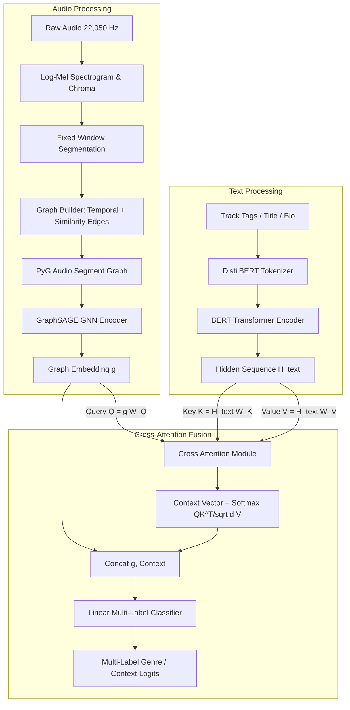

# GNN-Based BERT for Understanding Context from Music

**CSE425: Neural Networks & Deep Learning Course Project**

---

## 1. Project Overview

Understanding the semantic context, genre, and emotional nuances of music requires reasoning across two complementary modalities:
1. **Acoustic / Structural Modality**: Temporal dynamics, harmonic progressions, and chordal/segment similarities captured in audio.
2. **Textual / Contextual Modality**: Metadata, artist background, track tags, and cultural descriptors.

This project implements a hybrid **GNN-BERT Multi-Modal Architecture** that constructs segment-level temporal and similarity graphs from raw music audio, processes them through a **Graph Neural Network (GraphSAGE)**, encodes textual context using **BERT**, and fuses them via a **Cross-Attention Mechanism** where acoustic graph embeddings query textual representations.



---

## 2. Supported Tasks & Ablation Suite

| Task / Model | Modality | Architecture Description |
| :--- | :--- | :--- |
| **Task 1: BERT Baseline** | Text Only | DistilBERT $\to$ [CLS] $\to$ Dropout $\to$ Linear $\to$ Sigmoid |
| **Task 2: GNN Model** | Audio Graph Only | Segment Graph $\to$ GraphSAGE $\to$ Global Mean Pool $\to$ MLP |
| **Audio Baseline: CNN** | Audio Mel Only | Log-Mel Spectrogram $\to$ Conv2D Blocks $\to$ Global Pool $\to$ MLP |
| **Task 3 Ablation: Early Fusion** | Audio + Text | Concat(GraphSAGE Pool, BERT [CLS]) $\to$ MLP Classifier |
| **Task 3 Primary: Cross-Attention** | Audio + Text | GNN Queries $\times$ BERT Keys/Values $\to$ Concat $\to$ Classifier |

---

## 3. Dataset & Split Strategy

* **Dataset**: Free Music Archive (**FMA-Small**), consisting of 8,000 30-second tracks across 8 balanced top-level genres (1,000 tracks per genre).
* **Target Genres**: `Electronic`, `Experimental`, `Folk`, `Hip-Hop`, `Instrumental`, `International`, `Pop`, `Rock`.
* **Artist Leakage Prevention**: Predefined track-level splits (`data/splits/train.json`, `val.json`, `test.json`) ensure all tracks from the same artist reside strictly within a single split partition.

---

## 4. Repository Structure

```text
gnn-bert-music-context/
├── README.md                       # Complete documentation & usage guide
├── requirements.txt                # Python package dependencies
├── config.yaml                     # Central configuration for all hyperparameters
│
├── data/
│   ├── raw/                        # FMA, MagnaTagATune, MusicCaps downloads
│   ├── processed/                  # Preprocessed graphs, mel-spec, BERT caches
│   └── splits/                     # train.json, val.json, test.json
│
├── notebooks/
│   ├── eda.ipynb                   # Exploratory data analysis & feature exploration
│   └── demo_context.ipynb          # Interactive end-to-end inference demo
│
├── src/
│   ├── audio_features.py           # Mel, chroma, segmentation
│   ├── graph_builder.py            # Chord + segment graph construction
│   ├── bert_encoder.py             # Task 1 BERT multi-label classifier
│   ├── gnn_model.py                # Task 2 GraphSAGE & GAT classifiers
│   ├── baselines.py                # CNN baseline, Random & Majority baselines
│   ├── fusion_model.py             # Task 3 Cross-Attention & Early Fusion models
│   ├── cnn_fusion.py               # Improved CNN & CNN-BERT gated fusion
│   ├── contrastive.py              # Audio-text contrastive alignment
│   ├── datasets.py                 # PyTorch & PyG Dataset implementations
│   ├── metrics.py                  # F1, AUC-PR, threshold tuning utilities
│   ├── utils.py                    # Seeding, device detection, checkpoint I/O
│   ├── visualize.py                # Training curves, comparison charts, t-SNE
│   ├── train.py                    # Unified training pipeline for all tasks
│   └── evaluate.py                 # Centralized evaluation & model comparison
│
├── results/
│   ├── metrics.json                # Summary of evaluation metrics
│   ├── plots/                      # Training curves, heatmaps & t-SNE embeddings
│   └── retrieval_examples/         # Cross-modal retrieval outputs
│
└── report/
    └── final_report.pdf            # Comprehensive project report
```

---

## 5. Installation & Setup

### Environment Setup
```bash
# 1. Clone the repository
git clone https://github.com/IronRebirth/Multimodal-Music-Genre-Classification.git
cd Multimodal-Music-Genre-Classification

# 2. Install dependencies
pip install -r requirements.txt
```

---

## 6. Training & Evaluation

All tasks can be trained and evaluated using the unified entry points in `src/`.

### Train Models

```bash
# Task 1: BERT Text Baseline
python src/train.py --task bert --epochs 25 --batch_size 32

# Task 2: GraphSAGE Audio Graph Model
python src/train.py --task gnn --epochs 40 --batch_size 32

# Audio Baseline: CNN Mel Spectrogram
python src/train.py --task cnn --epochs 40 --batch_size 32

# Task 3 Primary: Cross-Attention GNN-BERT Fusion
python src/train.py --task fusion --epochs 35 --batch_size 32

# Task 3 Ablation: Early Concatenation Fusion
python src/train.py --task early_fusion --epochs 35 --batch_size 32
```

### Optional Training Flags
- `--config`: Path to custom YAML configuration (default: `config.yaml`).
- `--epochs`: Override number of training epochs.
- `--batch_size`: Override batch size.
- `--lr`: Override learning rate.
- `--loss`: Choose loss function (`bce` or `focal`).
- `--seed`: Set random seed for reproducibility.
- `--resume`: Path to checkpoint to resume training from.

### Comprehensive Evaluation

```bash
# Evaluate and compare all trained models against test split
python src/evaluate.py --all

# Evaluate a specific model checkpoint
python src/evaluate.py --checkpoint checkpoints/fusion_best.pt --task fusion
```

---

## 7. Interactive Notebooks

- **Exploratory Data Analysis**: Open `notebooks/eda.ipynb` to inspect audio representations, chord graphs, and text distributions.
- **Inference & Context Demo**: Open `notebooks/demo_context.ipynb` for step-by-step cross-modal prediction, cross-attention weight visualization, and text-to-music retrieval.

---

## 8. Evaluation Metrics

* **Macro-F1 & Micro-F1**: Evaluated across all 8 classes with optimal decision threshold tuned on the validation split.
* **Precision & Recall**: Computed per-class and aggregated across genres.
* **AUC-PR**: Area under the Precision-Recall curve (Macro and Micro).

---

## 9. Reproducibility & Checkpoints

* **Deterministic Seeding**: Fixed globally across `torch`, `numpy`, `random`, and `cudnn`.
* **Checkpoint Resumption**: Each checkpoint (`<task>_best.pt` and `<task>_last.pt`) preserves model weights, optimizer state, LR scheduler state, and training metadata.
* **Artifacts & Plots**: Test metrics, generated comparison tables, and plots are automatically written to `results/`.
